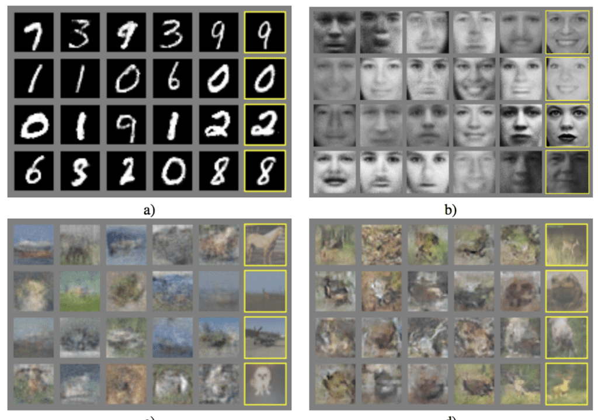

⚠️ This repository contains coursework notebooks from a 2023 GANs Udemy course.
Notebooks may include local file paths and raw experiments — kept here as a learning log, not a polished project.

# Generative AI with GANs — PyTorch (Course Work)

Hands-on implementations from a step-by-step Generative AI course, progressing from **basic GANs** to **diffusion/in-painting** and **multimodal** experiments. All work is notebook-driven.

## Repository Structure

- `Basic GAN.ipynb` — vanilla GAN on simple image data (e.g., MNIST); loss curves, generated samples.
- `Advanced GAN.ipynb` — deeper/conv-based GAN variants (DCGAN-style) for natural images; stability tweaks.
- `DiffusionModels_InPainting.ipynb` — diffusion workflow for image in-painting/editing.
- `Diffusion+ClipSeg_InPainting.ipynb` — in-painting guided by CLIP/segmentation signals.
- `MultimodalGeneration.ipynb` — text↔image experiments (prompt-guided generation ideas).
- `images/` — sample outputs / figures.
- `wandb/` — Weights & Biases logs (if enabled).
- `.gitignore`

## Example Results

> 
